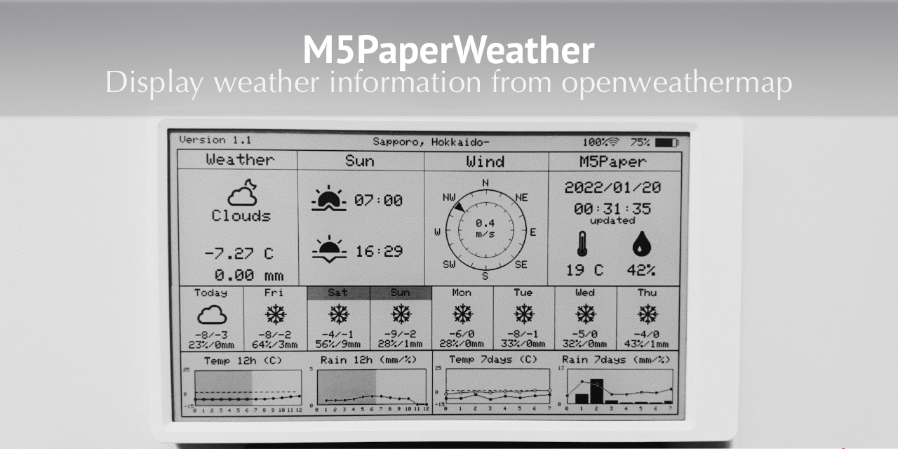

## M5PaperWeather
  **M5Paper project with weather information from openweathermap ***

   

Originally forked from [https://github.com/Bastelschlumpf/M5PaperWeather](https://github.com/Bastelschlumpf/M5PaperWeather)
### Description
  **Platform.io** project to show internal environment data and weather information from 
  openweathermap https://openweathermap.org on the e-ink display of the M5Paper.
  Please copy the **Config.hpp** file, rename it to ConfigOverride.hpp, and edit it with your own data.
  You need an api key from openweathermap.
  The software shows the following information:
  * A header with version, city wifi strength and battery status
  * _[NEW]_ Current weather icon, status, temperature and rain in mm
  * Sun section with sunrise and sunset 
  * Wind section with wind direction and wind speed
  * The internal SH30 sensor data (temperature and humidity) with the current date and time
  * _[NEW]_ A daily forecast with min/max temperature, probability of precipitation, and a weather icon.
  * _[NEW]_ Hourly and daily forecast graphs with temperature and rain.

### License
   This program is licensed under GPL-3.0

### Thanks
   * https://www.arduino.cc
     *Thanks to the Arduino community with all its incredible possibilities and support.** 
   * Special thanks for the drawing function of the moon and the wind section from David Bird
     https://github.com/G6EJD/ESP32-Revised-Weather-Display-42-E-Paper
